# Simulación ataque de fuerza bruta

Se ejecutará un ataque de fuerza bruta, intentando múltiples combinaciones de contraseñas para acceder a la cuenta de un usuario en el servidor web. Este tipo de ataque busca obtener acceso no autorizado a través de la repetición sistemática de contraseñas.

Ahora que entendemos qué es este tipo de ataque, procederemos a realizarlo. Desde la máquina Kali (VM02), accedemos a la página web vulnerable DVWA ingresando la URL **http://10.2.2.3** en el navegador. Nos registramos con las credenciales de inicio de sesión del laboratorio de ciberseguridad DVWA (usuario:admin y contraseña:password), como se aprecia en la Figura 1.


Justo después, vamos a la sección de Brute Force (Figura 2), donde encontramos un panel de login con usuario y contraseña.

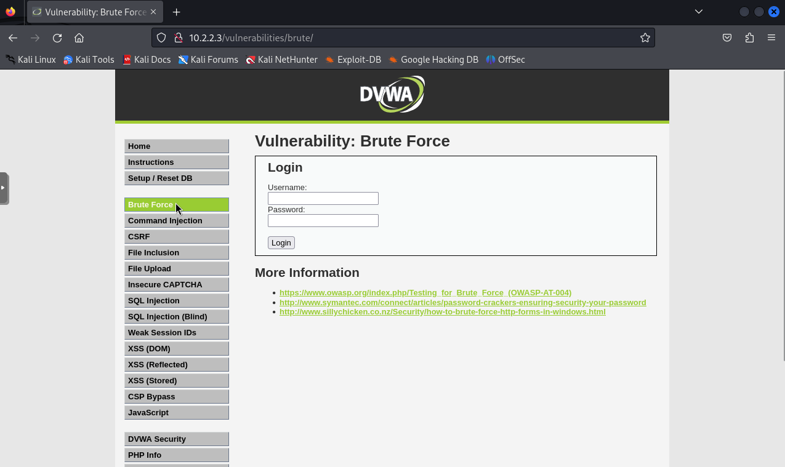

Para realizar este ataque de fuerza bruta sobre el servidor web, abriremos la herramienta Burpsuite para interceptar la solicitud HTTP y ver qué parámetros se están enviando. Dentro de Burpsuite, vamos a **Proxy Settings** y como se muestra en la Figura 3, configuramos el Proxy para escuchar en 127.0.0.1 por el puerto 8080.

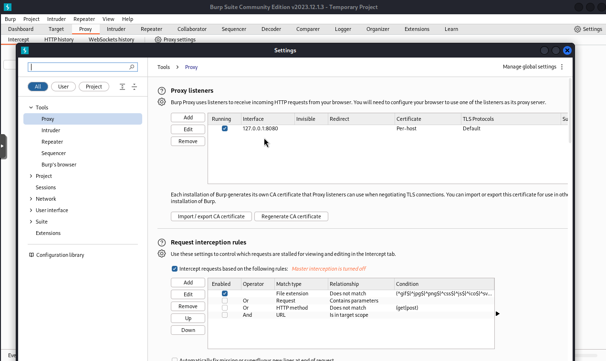

Luego, configuramos las opciones de red del navegador Firefox en **General > Network Settings**, seleccionamos **Manual proxy configuration** e ingresamos los mismos parámetros que configuramos en Burpsuite (Figura 3). La configuración de Firefox se muestra en la Figura 4.

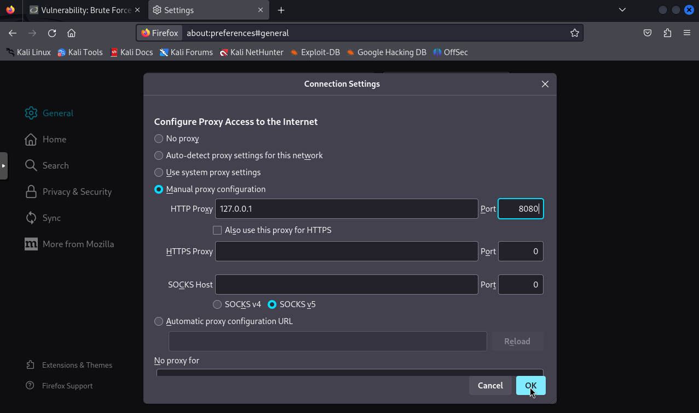

A continuación, volvemos a Burpsuite y comenzamos a interceptar las solicitudes HTTP realizadas desde Firefox (Figura 5).

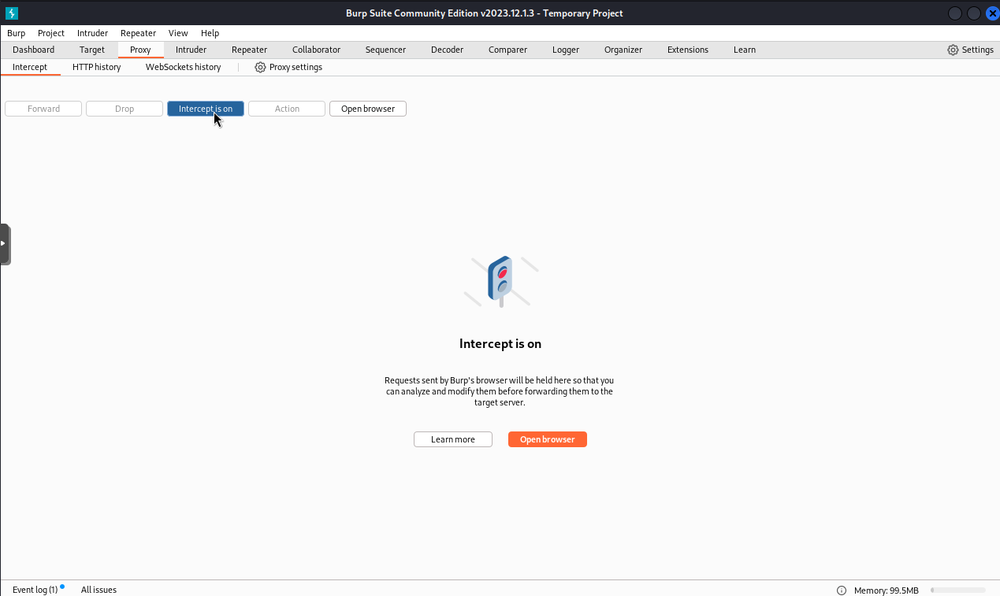

Regresamos a la página web DVWA, específicamente a su sección Brute Force, y como se observa en la Figura 6, enviamos una solicitud con los parámetros vacíos.

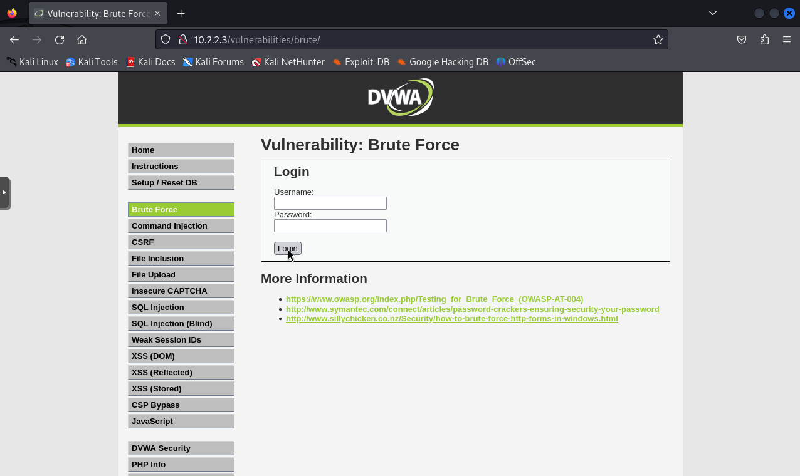

Una vez hecho esto, podemos ver información clave en la solicitud interceptada desde Burpsuite (Figura 7):
- Es una solicitud GET.
- Los parámetros de login (username=&password=&Login=Login).
- La cookie de sesión (PHPSESSID=v906fq0ons3ickgt4pc0gadoq0; security=low).

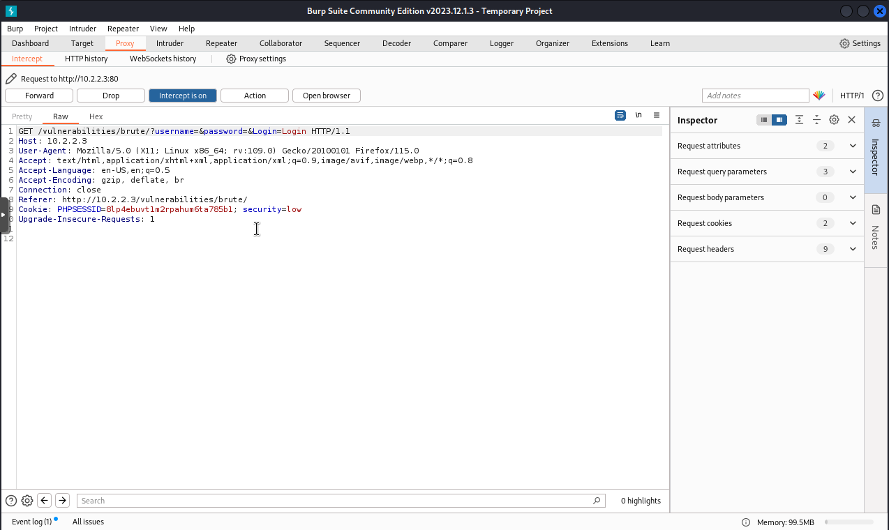

Con esta información, podemos recrear una solicitud HTTP válida y llevar a cabo el ataque de fuerza bruta.

La herramienta que utilizaremos para este ataque es **THC Hydra**, la cual puede realizar un ataque de diccionario rápido y eficaz contra el servicio de autenticación.

Para realizar nuestro ataque de fuerza bruta con Hydra, necesitaremos proporcionar la siguiente información:

- **Servidor objetivo**: La dirección IP del servidor al que vamos a atacar, en este caso, `10.2.2.3`.
- **Ruta de la URL**: La ruta específica del formulario de inicio de sesión en el servidor, que es `/vulnerabilities/brute/index.php`.
- **Nombre de usuario**: El nombre de usuario que vamos a utilizar en el ataque (supondremos que es `admin`).
- **Diccionario de contraseñas**: La ruta al archivo que contiene una lista de posibles contraseñas, `/usr/share/wordlist/fasttrack.txt`.
- **Cookie**: Necesitamos proporcionar una cookie específica para mantener la sesión, que en este caso es `PHPSESSID=v906fq0ons3ickgt4pc0gadoq0; security=low`.
- **Mensaje de fallo**: La cadena que indica un intento de inicio de sesión fallido, que es `Username and/or password incorrect.`.

El comando completo que usaremos para llevar a cabo el ataque de fuerza bruta desde la máquina virtual Kali (VM02) se muestra en la Figura 8.

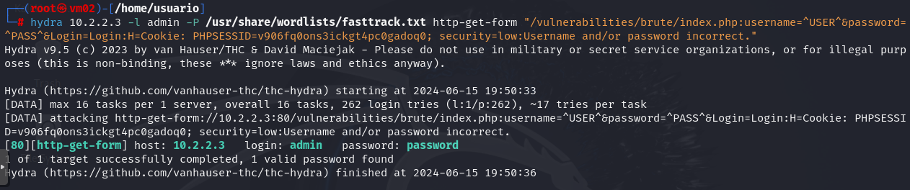

A continuación, explicaremos cada parte del comando:

```bash
hydra 10.2.2.3 -l admin -P /usr/share/wordlist/fasttrack.txt http-get-form "/vulnerabilities/brute/index.php:username=^USER^&password=^PASS^&Login=Login:H=Cookie:PHPSESSID=v906fq0ons3ickgt4pc0gadoq0; security=low:Username and/or password incorrect."
```
- **hydra**: El comando para iniciar Hydra.
- **10.2.2.3**: La IP del servidor objetivo.
- **-l admin**: Especifica el nombre de usuario a utilizar en el ataque.
- **-P /usr/share/wordlist/fasttrack.txt**: Proporciona la ruta al archivo de diccionario de contraseñas.
- **http-get-form**: Utiliza el módulo de Hydra para atacar formularios web mediante el método HTTP GET.
- **"/vulnerabilities/brute/index.php=^USER^&password=^PASS^&Login=Login"**: Define la ruta y los parámetros del formulario de inicio de sesión.  Los marcadores ^USER^ y ^PASS^ serán reemplazados por Hydra con el nombre de usuario y las contraseñas del diccionario, respectivamente. H=Cookie=v906fq0ons3ickgt4pc0gadoq0; security=low: Proporciona una Cookie adicional necesaria para la sesión.
- **Username and/or password incorrect.**: La cadena que Hydra busca en la respuesta del servidor para determinar si las credenciales fueron incorrectas.

Una vez realizado el ataque con Hydra, como se puede ver en la Figura hydra, hemos conseguido averiguar la contraseña válida para iniciar sesión en el panel de autenticación (usuario:admin y contraseña:password) en la web DVWA, una vez conocido el usuario.

Inmediatamente después de ejecutar el ataque de fuerza bruta con la herramienta hydra sobre la página web DVWA objetivo, nos llega una alerta a Gmail (Figura 9), notificando que se ha producido un intento de ataque de fuerza bruta el día 15 de junio de 2024 a las 17:50:34 (UTC). Además, observamos que la regla que ha saltado en Suricata se llama Possible Hydra Brute Force Attack con un SID de 400004, en la categoría Web Application Attack, y la IP del host afectado es 10.2.2.3.

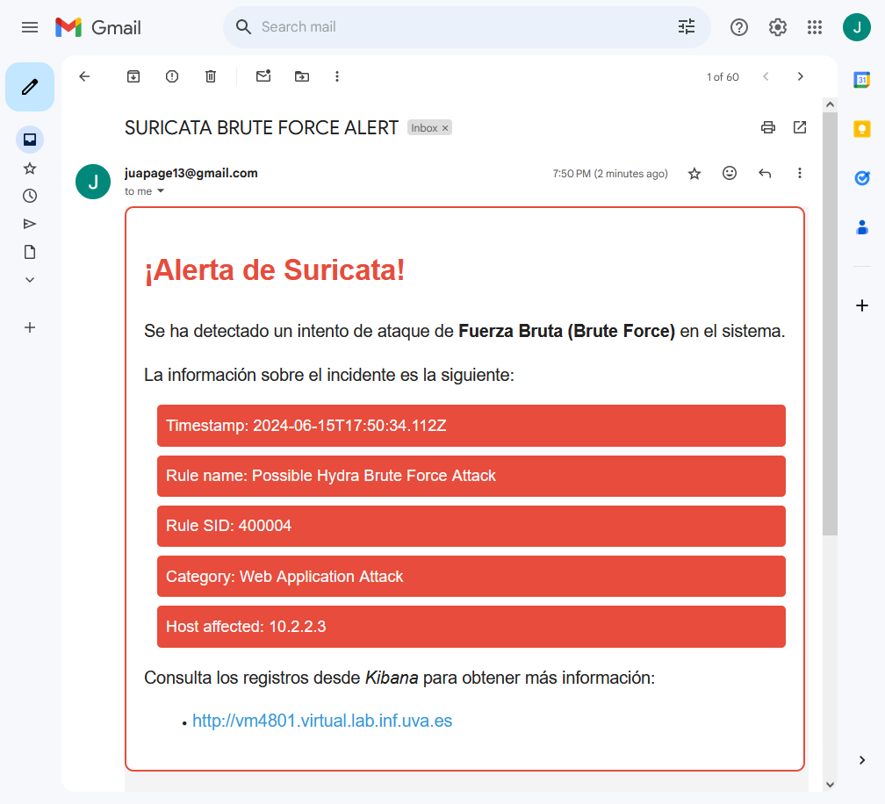

Para ver más información, podemos hacer clic en el enlace que nos lleva a la web de Kibana alojada en el puerto 80 de la VM01. Una vez en Kibana, podemos ver el Events Dashboard de Suricata (Figura 10), el cual muestra información más detallada como el número de eventos que se han producido en los últimos 5 minutos (2,876 eventos), el número de alertas que han saltado o los distintos protocolos de red que ha detectado en ese periodo de tiempo, entre otras cosas.

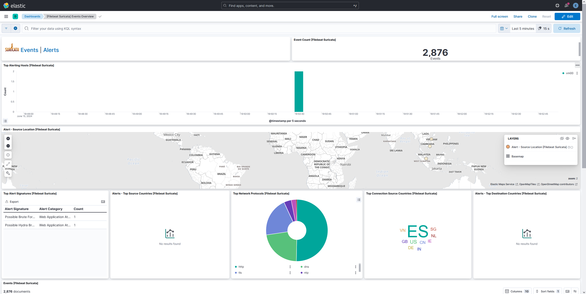

Por otra parte, tendríamos el Alerts Dashboard (Figura 11), donde vemos que se han producido 2 alertas de Suricata en los últimos 5 minutos. La primera alerta salta porque se ha detectado la cadena Hydra en la solicitud HTTP dirigida al servidor Web, y la segunda salta porque se han realizado más de 10 intentos de inicio de sesión en el formulario ubicado en /vulnerabilities/brute en un periodo de 10 segundos. Ambas alertas coinciden perfectamente con el ataque de fuerza bruta realizado previamente con la herramienta Hydra.

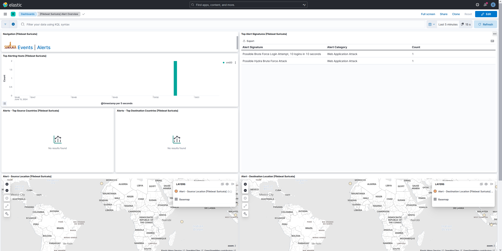

Finalmente, si se desea ver información sobre el incidente en profundidad, existe la posibilidad de ver el JSON log que se envió desde la máquina donde está Suricata, como se puede apreciar en la Figura 12.

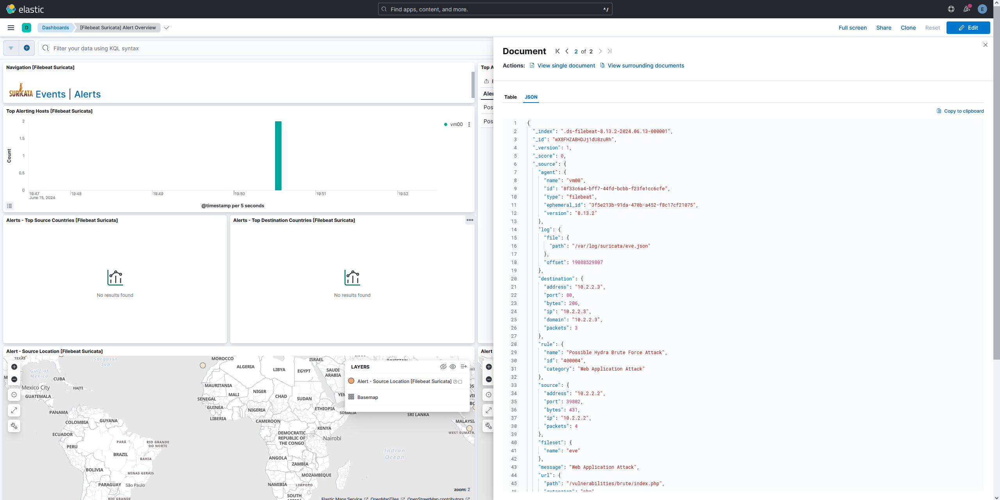