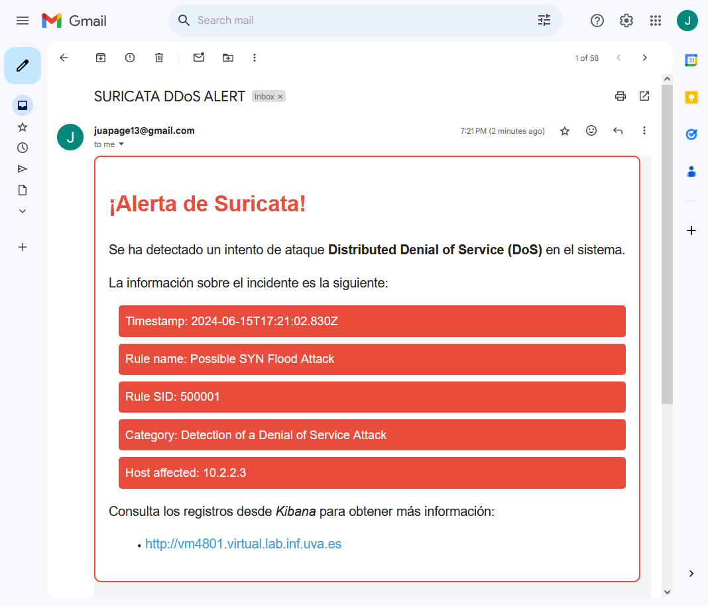

# Simulación ataque DDoS

En esta prueba, se llevará a cabo un ataque de denegación de servicio (Distributed Denial of Service, DDoS). El objetivo es hacer que el servidor web sea inaccesible para los usuarios legítimos, saturando los recursos del servidor con tráfico malicioso.

Para lanzar el ataque DDoS emplearemos la herramienta **hping3**, la cual se utiliza para enviar paquetes a través de una red y analizar las respuestas. Además, es comúnmente utilizada para pruebas de penetración y diagnóstico de red.

El comando completo que hemos utilizado en el ataque desde la máquina virtual Kali (VM02) lo podemos observar en la Figura 1.


A continuación, explicaremos cada componente del comando.

```bash
timeout 15s hping3 -S --flood -V -p 80 10.2.2.3 --rand-source
```
- **timeout 15s**: Ejecutará el comando hping3 durante 15 segundos.
- **-S**: Indica que se enviarán paquetes TCP con la bandera SYN establecida. Esto simula el inicio de una conexión TCP.
- **--flood**: Esta opción indica que se enviarán los paquetes tan rápido como sea posible, sin esperar una respuesta del servidor. Se utiliza para realizar ataques de inundación.
- **-V**: Activa el modo verbose, proporcionando información detallada sobre lo que está sucediendo mientras se ejecuta el comando.
- **-p 80**: Especifica el puerto de destino al que se enviarán los paquetes. En este caso, los paquetes se dirigirán al puerto 80, utilizado comúnmente por los servidores web para el tráfico HTTP.
- **10.2.2.3**: Es la dirección IP del servidor al que se enviarán los paquetes.
- **--rand-source**: Indica que se utilizarán direcciones IP de origen aleatorias al enviar los paquetes. Esto puede hacer que el ataque sea más difícil de detectar y mitigar.

Nada más ejecutar el ataque DDoS con la herramienta hping3 sobre la página web DVWA objetivo nos llega una alerta al Gmail (Figura 2), alertando que se ha producido un intento de ataque DDoS el día 15 de junio de 2024 a las 17:21:02 (UTC). Además, podemos ver que la regla que ha saltado en Suricata se llama Possible SYN Flood Attack con un SID de 500001, en la categoría Detection of a Denial of Service Attack y la IP del host afectado es 10.2.2.3.



Para ver más información podemos pinchar en el enlace que nos lleva a la web de Kibana que está alojada en el puerto 80 de la VM01. Una vez en Kibana podemos ver el Events Dashboard de Suricata (Figura 3), el cual muestra información más detallada como el número de eventos que se han producido en los últimos 5 minutos (253,248 eventos), el número de alertas que han saltado o los distintos protocolos de red que ha detectado en ese periodo de tiempo, entre otras cosas.


Por otro lado, tendríamos el Alerts Dashboard (Figura 4), donde observamos que se ha producido 1 alerta de Suricata en los últimos 5 minutos. La alerta salta porque se ha detectado más de 5000 solicitudes SYN con destino al servidor Web en un periodo de 20 segundos, lo cual cuadra con el ataque DDoS que hemos realizado anteriormente con hping3.


Para terminar, si se quisiera ver información sobre el incidente más en detalle existe la posibilidad de ver el JSON log que se envió desde la máquina donde está Suricata, tal y como podemos apreciar en la Figura 5.

