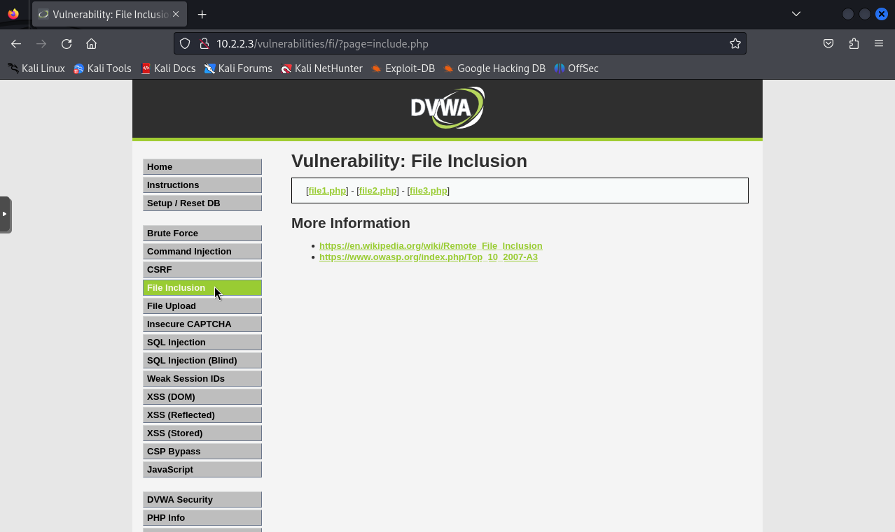
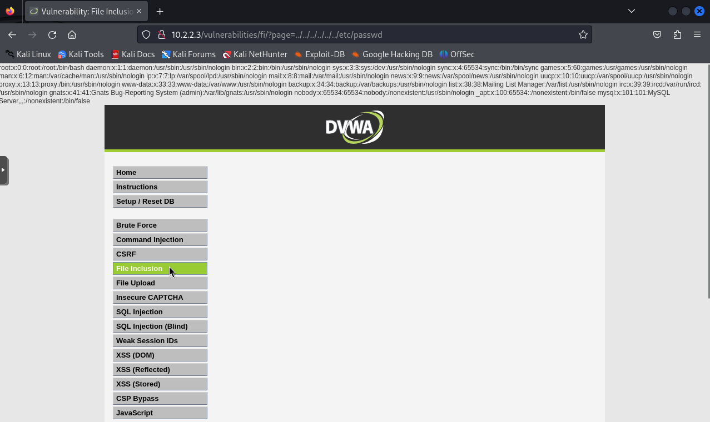
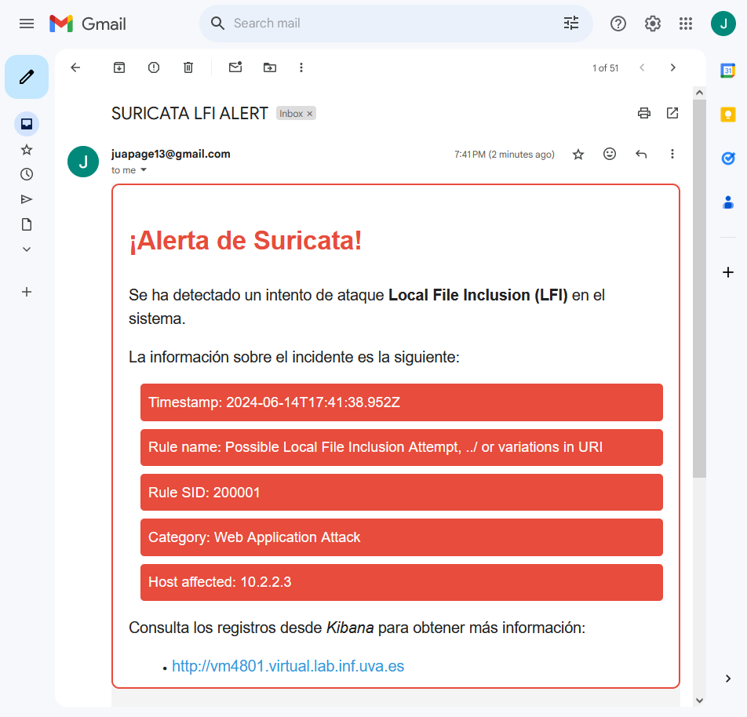
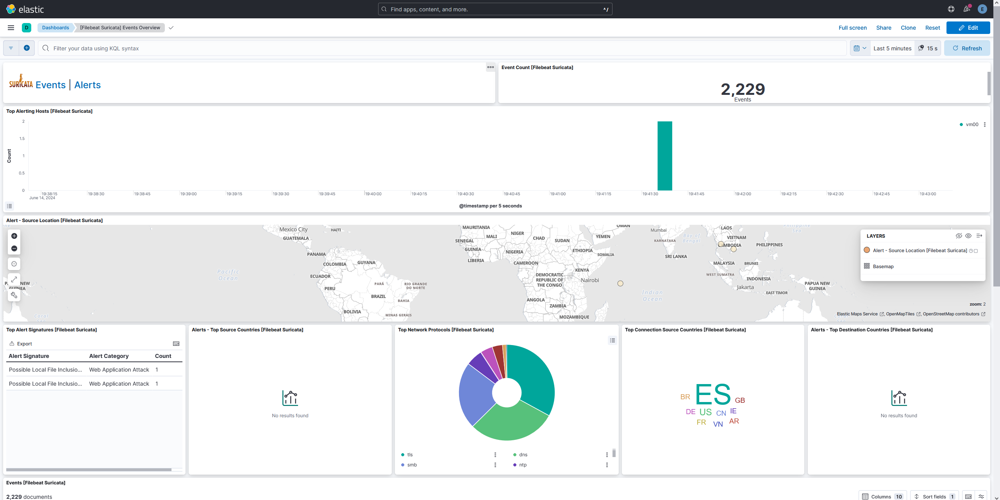
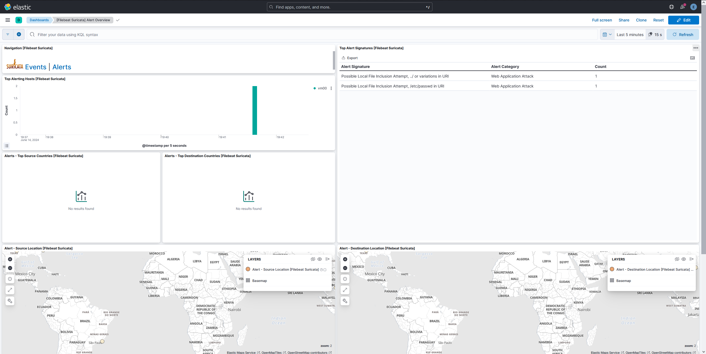
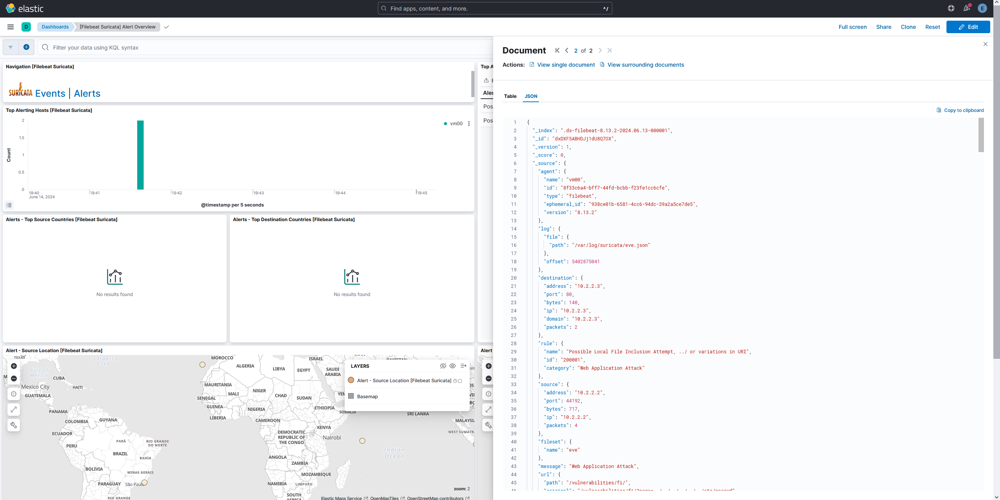

# Simulación ataque LFI

En esta prueba, se llevará a cabo un ataque de inclusión de archivos locales (Local File Inclusion, LFI). Este tipo de ataque permite a un atacante incluir archivos locales en el servidor web, lo que puede conducir a la exposición de información sensible o la ejecución de código arbitrario.

Una vez entendido lo que es este tipo de ataque, vamos a proceder a realizarlo. Primero desde la máquina Kali (VM02) accedemos a la página web vulnerable DVWA poniendo en el navegador la URL **http://10.2.2.3**. Nos registramos con las credenciales de inicio de sesión del laboratorio de ciberseguridad DVWA (usuario:admin y contraseña:password), como se ve en la Figura 1.

Acto seguido, vamos a la sección de File Inclusion (Figura 2), donde podemos ver que es una página desde la cual nos podemos descargar tres archivos distintos en formato PHP.

Para realizar el ataque LFI, cambiamos el parámetro `?page=include.php` por `?page=../../../../../../etc/passwd` y de esta manera podemos apreciar en la Figura 3 que se produce una filtración de información sensible, ya que nos muestra por pantalla el contenido del archivo `/etc/passwd` de la máquina VM03 con sus correspondientes usuarios.

Unos segundos después de haber realizado el ataque LFI sobre la página web DVWA objetivo, nos llega una alerta a Gmail (Figura 3), notificando que se ha producido un intento de ataque LFI el día 14 de junio de 2024 a las 17:41:38 (UTC). Además, podemos ver que la regla que ha saltado en Suricata se llama **Possible Local File Inclusion Attempt, ../ or variations in URI** con un SID de **200001**, en la categoría **Web Applications Attack**, y la IP del host afectado es **10.2.2.3**.

Para ver más información, podemos hacer clic en el enlace que nos lleva a la web de Kibana alojada en el puerto 80 de la VM01. Una vez en Kibana, podemos ver el **Events Dashboard** de Suricata (Figura 4), el cual muestra información más detallada como el número de eventos que se han producido en los últimos cinco minutos (2,229 eventos), el número de alertas que han saltado o los distintos protocolos de red que ha detectado en ese periodo de tiempo, entre otros.

Por otra parte, está el **Alerts Dashboard** (Figura 5), donde observamos que se han producido dos alertas de Suricata en los últimos cinco minutos. La primera salta porque ha detectado `../` en el URI de una solicitud HTTP que fue al servidor Web, y la segunda porque ha detectado también la cadena `/etc/passwd` en el URI, lo cual es exactamente lo que llevaba la solicitud HTTP que se realizó en el ataque LFI previo.

Por último, si se quisiera ver información sobre el incidente más en profundidad, existe la posibilidad de ver el **JSON log** que se envió desde la máquina donde está Suricata, tal y como podemos observar en la Figura 6.

