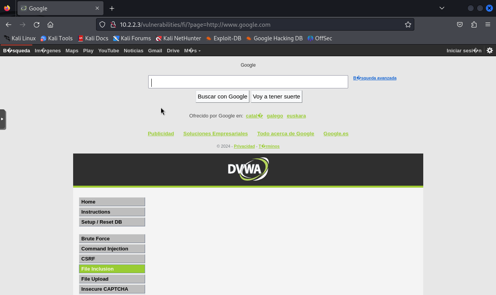

# Simulación ataque LFI

Para esta prueba, se realizará un ataque de inclusión de archivos remotos (Remote File Inclusion, RFI). Este tipo de ataque permite a un atacante incluir archivos remotos en el servidor web, lo que puede conducir a la ejecución de código arbitrario en el servidor afectado.

Para llevar a cabo este ataque, primero accedemos a la página web vulnerable DVWA desde la máquina Kali (VM02) ingresando la URL **http://10.2.2.3** en el navegador. Luego, nos registramos utilizando las credenciales de inicio de sesión del laboratorio de ciberseguridad DVWA (usuario:admin y contraseña:password), como se ve en la Figura 1.

Una vez registrados, navegamos a la sección de File Inclusion (Figura 2), donde encontramos una página que nos permite descargar tres archivos distintos en formato PHP.

Para llevar a cabo el ataque RFI, modificamos el parámetro de la URI `?page=include.php` por `?page=http://www.google.com` y observamos en la Figura 3 que se produce una inclusión exitosa del archivo remoto, ya que se muestra el contenido de la página web de Google en la interfaz de DVWA.

Unos instantes después de realizar el ataque RFI sobre la página web DVWA objetivo, nos llega una alerta a Gmail (Figura 4), notificando que se ha producido un intento de ataque RFI el día **14 de junio de 2024 a las 17:56:17 (UTC)**. Además, podemos ver que la regla que ha saltado en Suricata se llama **Possible Remote File Inclusion Attempt, http/https in URI** con un SID de **300001**, en la categoría **Web Applications Attack**, y la IP del host afectado es **10.2.2.3**.

Para ver más información, podemos hacer clic en el enlace que nos lleva a la web de Kibana alojada en el puerto 80 de la VM01. Una vez en Kibana, podemos ver el **Events Dashboard** de Suricata (Figura 5), el cual muestra información más detallada como el número de eventos que se han producido en los últimos 5 minutos (4,643 eventos), el número de alertas que han saltado o los distintos protocolos de red que ha detectado en ese periodo de tiempo, entre otras cosas.

Por otra parte, está el **Alerts Dashboard** (Figura 6), donde observamos que se ha producido una alerta de Suricata en los últimos 5 minutos. La alerta salta porque se ha detectado la cadena **=http** en el URI de una solicitud HTTP que fue al servidor Web, lo cual es justo lo que llevaba la solicitud HTTP que se realizó en el ataque RFI hecho anteriormente.

Por último, si se quisiera ver información sobre el incidente más a fondo, existe la posibilidad de ver el **JSON log** que se envió desde la máquina donde está Suricata, tal y como podemos observar en la Figura 7.

