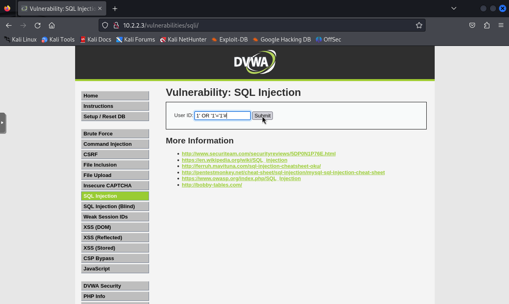

# Simulación ataque SQLI

Se simulará un ataque de inyección SQL (SQL Injection), donde se intentará inyectar código SQL malicioso en las consultas a la base de datos del servidor web. Este tipo de ataque puede resultar en la manipulación o destrucción de datos.

Ahora que ya sabemos en qué consiste un ataque SQLI, vamos a simularlo. Para empezar desde la máquina virtual Kali (VM02) accedemos a la página web vulnerable DVWA poniendo en el navegador la URL **http://10.2.2.3**. Nos registramos con las credenciales de inicio de sesión del laboratorio de ciberseguridad DVWA (usuario: admin y contraseña: password), como se ve en la Figura 1.

Una vez dentro de la web DVWA vamos a la sección de **SQL Injection** y en el campo que está pensado para buscar a un usuario según un ID introduciremos la consulta maliciosa **1' OR '1'='1'#**, como se ve en la Figura 2.

Después, como observamos en la Figura 3 el ataque SQLI ha sido exitoso, debido a que hemos conseguido que se nos muestren los datos de todos los usuarios de la base de datos con la consulta maliciosa.

Unos pocos segundos después de realizar el ataque SQLI recibimos una alerta en GMAIL (Figura 4), donde se ven algunos datos sobre el incidente como por ejemplo cuando se realizó (**14 de junio de 2024 a las 18:09:34 UTC**), el nombre de la regla (**Possible SQL Injection Attempt - Detected 'OR' Pattern in URI**), el SID **100013**, la categoría de la alerta (**Web Application Attack**) y la IP del host afectado (**10.2.2.3**).

Para ver más información podemos pinchar en el enlace que nos lleva a la web de Kibana que está alojada en el puerto 80 de la VM01. Una vez en Kibana podemos ver el **Events Dashboard** de Suricata (Figura 5), el cual muestra información más detallada como el número de eventos que se han producido en los últimos 5 minutos (3.979 eventos), el número de alertas que han saltado o los distintos protocolos de red que ha detectado en ese periodo de tiempo, entre otras cosas.

Por otro lado, está el **Alerts Dashboard** (Figura 6), donde observamos que se ha producido 1 alerta de Suricata en los últimos 5 minutos. La alerta salta porque se ha detectado la cadena **OR** en el URI de una solicitud HTTP que fue al servidor Web, lo cual es lo que llevaba la solicitud HTTP que se realizó en el ataque SQLI hecho con anterioridad.

Para terminar, si se quisiera ver en detalle más información sobre el incidente existe la posibilidad de ver el **JSON log** que se envió desde la máquina donde está Suricata, como se aprecia en la Figura 7.

