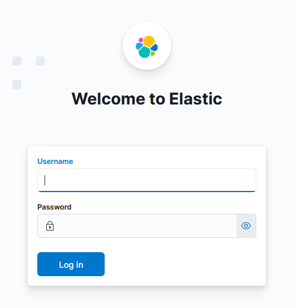

# VM01 - Elastic server
## 1. Instalación de ubuntu-server
Instalar ubuntu-server 22.04.4 y actualizar el sistema operativo.
```bash
sudo apt update
sudo apt upgrade
```
## 2. Configuración de red
Editamos el fichero de configuración de red `/etc/network/interfaces` para que tenga el siguiente contenido.
```bash
auto lo
iface lo inet loopback

# RLAB - VLAN 799 - IP Lab48 por DHCP
auto ens18
iface ens18 inet dhcp

# RINT - VLAN 798
auto ens19
iface ens19 inet static
      address 10.2.2.1
      netmask 255.255.255.0
```

Reiniciamos el servicio de red para aplicar los cambios realizados.
```bash
sudo systemctl restart networking.service
```

Deberíamos de tener la siguiente configuración de red.
```bash
root@vm01:~# ip a
1: lo: <LOOPBACK,UP,LOWER_UP> mtu 65536 qdisc noqueue state UNKNOWN group default qlen 1000
    link/loopback 00:00:00:00:00:00 brd 00:00:00:00:00:00
    inet 127.0.0.1/8 scope host lo
       valid_lft forever preferred_lft forever
2: ens18: <BROADCAST,MULTICAST,UP,LOWER_UP> mtu 1500 qdisc fq_codel state UP group default qlen 1000
    link/ether 08:00:27:09:48:01 brd ff:ff:ff:ff:ff:ff
    altname enp0s18
    inet 10.0.48.1/18 brd 10.0.63.255 scope global dynamic ens18
       valid_lft 1489sec preferred_lft 1489sec
3: ens19: <BROADCAST,MULTICAST,UP,LOWER_UP> mtu 1500 qdisc fq_codel state UP group default qlen 1000
    link/ether 08:00:27:98:48:01 brd ff:ff:ff:ff:ff:ff
    altname enp0s19
    inet 10.2.2.1/24 brd 10.2.2.255 scope global ens19
       valid_lft forever preferred_lft forever
```
## 3. Instalar docker y docker-compose
Instalamos docker en la versión `24.0.5`.
```bash
sudo apt install docker.io
```

Comprobamos que la versión de docker es la `24.0.5`.
```bash
root@vm01:~# docker -v
Docker version 24.0.5, build 24.0.5-0ubuntu1~22.04.1
```

Instalamos `docker-compose`.
```bash
sudo apt install docker-compose-v2
```

Verificamos la versión de `docker-compose`, para ver que se instaló correctamente.
```bash
root@vm01:~# docker compose version
Docker Compose version 2.20.2+ds1-0ubuntu1~22.04.1
```

Añadimos al usuario `usuario` al grupo de `docker`, para que este pueda usar docker sin problemas.
Esto se hace modificando esta línea en el fichero de configuración `/etc/group`.
```bash
docker:x:120:usuario
```

Reiniciamos los servicios de docker para evitar conflictos con el siguiente comando.
```bash
sudo systemctl restart docker.service docker.socket
```

## 4. Despliegue de Elasticsearch, Kibana  y Elastalert2 con docker compose
### 4.1. Configuración del fichero docker-compose.yaml
Primero creamos un directorio vacío llamado `elk` con `mkdir elk`.

Creamos el fichero de configuración de variables de entorno para elk `.env`.


Creamos el archivo `docker-compose.yaml`, que despliega los contenedores de elasticsearch, kibana y elastalert2.
[Fichero de despliegue docker-compose.yaml](../vm01-Elastic/docker-compose.yaml)

### 4.2. Configuración de Elastalert2
Dentro del directorio creado previamente `~/elk` creamos un directorio para elastalert2 `mkdir elastalert2`.

En este nuevo directorio creamos el fichero de configuración `elastalert2.yaml`.


Además creo el fichero `smtp_auth.yaml` donde están las credenciales para conectarme al servidor de `SMTP`.


Después creamos otra carpeta dentro de `~/elk/elastalert2` para almacenar las reglas de elastalert2 `mkdir rules`.

Dentro de la carpeta `~/elk/elastalert2/rules` creo el fichero que define una regla para elastalert2 llamado `suricata_alert_rule.yaml`.


Para que los contenedores se desplieguen tal y como viene definido en el archivo `docker-compose.yml` ejecutamos el siguiente comando.
```bash
sudo docker-compose up -d
```

Como se puede apreciar tras el despliegue los contenedores están corriendo satisfactoriamente.
```bash
usuario@vm01:~/elk$ docker ps -a
CONTAINER ID   IMAGE                                                  COMMAND                  CREATED              STATUS                        PORTS                               NAMES
272972ba3160   jertel/elastalert2:2.17.0                              "/opt/elastalert/run…"   About a minute ago   Up 5 seconds                                                      elastalert2
16175c46765c   docker.elastic.co/kibana/kibana:8.13.2                 "/bin/tini -- /usr/l…"   About a minute ago   Up 41 seconds (healthy)       0.0.0.0:80->5601/tcp                kibana
d7bb15a8fbfe   docker.elastic.co/elasticsearch/elasticsearch:8.13.2   "/bin/tini -- /usr/l…"   About a minute ago   Up About a minute (healthy)   10.2.2.1:9200->9200/tcp, 9300/tcp   elasticsearch
3be69e83fd49   docker.elastic.co/elasticsearch/elasticsearch:8.13.2   "/bin/tini -- /usr/l…"   About a minute ago   Exited (0) 36 seconds ago                                         setup
```

Si accedemos a la página de `kibana` nos aparece un panel de inicio de sesión, donde se introducirán las credenciales de elastic.


Una vez introducidas las credenciales de elastic podemos observar que estamos dentro de kibana y todo funciona correctamente.


Para configurar la contraseña de GMAIL para SMTP para que funcione sin problemas elastalert2 es necesario añadir una `App password`.


Por último, para copiar del contenedor de elasticsearch al host el `ca.crt` que necesitaremos pasar a la máquina donde estará instalado `Filebeat`.
```bash
docker cp elasticsearch:/usr/share/elasticsearch/config/certs/ca/ca.crt ./ca.crt
```
